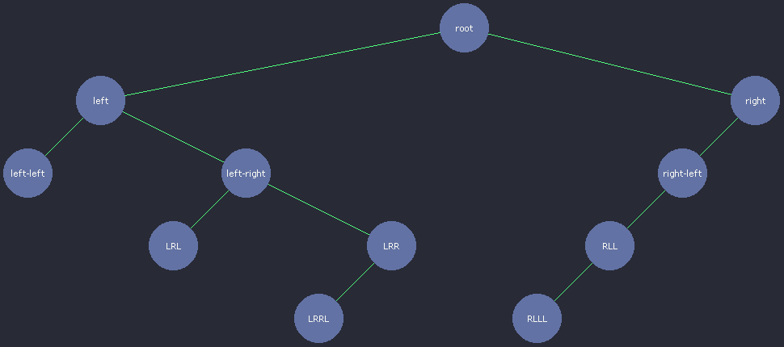
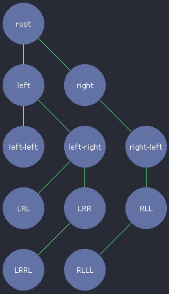

# Tree Rendering
A collection of tree data structure spatial positioning algorithms

## History and Motivation
While attempting to render computer science tree data structures, I was
surprised to find that there are not many free available implementations
suited for my needs.

After some research, I found Bill Mill's great [article][1] and [repository][2]
on the subject, though it wasn't compatible with the latest python version.
I made a [pull request][3] to bring it up to date, and learned more about
how to render trees.

I started to implement them in C++ and I had completed most of them.
Unfortunately due to a hdd failure, I lost those implementations.
Still I found myself in a situation where  I need to use them again.

So I decided to reimplement a few of them and add to a public GitHub repository
effectively making them easily available for anyone that might need to render
these trees.

## Available Algorithms

### Knuth

### Wetherell Shannon minimum tree

[1]: http://llimllib.github.io/pymag-trees/
[2]: https://github.com/llimllib/pymag-trees/
[3]: https://github.com/llimllib/pymag-trees/pull/10
